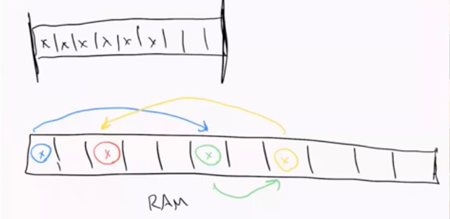

# Data Structures

Data Structures, like tools, have a best use case that they are each optimal for. We could hammer in a nail using a wrench or a screwdriver instead of a hammer -- but the tool that _best_ handles nails is a hammer.

Learning about the strengths and pitfalls of each data structure will help us use them most appropriately when writing code.

Just because something _can_ get the job done, doesn't mean it will do it efficiently. Choosing the best use type helps improve run time or space efficiency.

Some types have more use cases than others, even if they are rarer in real life implementation (heaps v arrays and hash tables).

In interviews, it's common to be asked about more niche implementations of data structures or accurately choosing the most efficient data structure to solve an algorithm. 

## Linked Lists

Sean Chen Lecture: https://youtu.be/wjeheracQ6U

Linked Lists and Arrays are very similar - both are used for storing lists of data. Arrays are usually included as part of any language's library but linked lists are not necessarily (JS and Python do not export a standard linked list implementation), so we are more familiar with arrays. We see them commonly.

With arrays, the information stored within them are all physicaly stored next to each other in memory.

A linked list might be better represented as a bead necklace - little nodes connected by a link (beads by string). There is no requirement that this data exist next to each other in memory. Instead, each item in the list points to the next item's location in memory.




What are the advantages of each data structure?

If our memory is already being used up by other applications - there are available spots but not that many. If we use an array, we need that specific size of continuous space for that array. A linked list is more memory flexible by using the available spaces.

That said, this con of linked lists is more conceptual than applicable. Typically, arrays are still considered to be more memory efficient and this would not be a factor in choosing a linked list over an array.

##### A good reason to decide which one to use is considering the run time of removing or inserting an item from the linked list v array.

If we wanted to remove the first item in an array, there would be a hole in the first spot of the array. Arrays are unhappy if the hole is anywhere other than the end of the array - so the remaining elements are shifted one to the left. The runtime of that change is O(n). A very large array would have a significant shift run time. 

Removing any elements from the front or middle of an array is a linear operation in the worst case (the exception is removing from the end).

If we wanted to insert a new element to the start (or middle) or an array, we have to shift the other elements to the right to make room for a new item to be added into the continuous array space in memory.

Again, insert (other than to the end of an array) has a linear run time O(n).

Arrays are only efficient when adding/removing from the end.

Linked Lists instead have a basic "head of the list" and "tail of the list", with references to each.

```
H -> x -> x -> x -> x -> T
```

To remove an item from the start of the linked list, we would need to shift the Head Reference to the second item in the linked list (the new Head of the list) and then remove the first node.

```
H -> x -> x -> x -> T
```

Nothing is shifted. The pointers to the next item in the list are simply being moved around. 

If we wanted to add a new element into the middle of the list, we would simply add a new node, that holds a reference to the previous and next node in the list. Nothing is being shifted, just the pointers are being re-drawn.

No matter how big the linked list is, the run time is constant O(1).

Adding or removing from the end of the linked list retains the same run time as an array too - so it's more efficient overall and equally efficient to the array's best case scenario.


## Implementing Linked Lists

Typically with linked list implementations, there's a node class and a linked list class (which builds on top of the node class).

```
class Node:
    def __init__(self, value=None, next_node=None):
        self.value = value
        self.next_node = next_node

```

Our Node class starts with a value that defaults to none and a next_node that also defaults to None. We'll also add some methods:

```
class Node:
    def __init__(self, value=None, next_node=None):
        self.value = value
        self.next_node = next_node
    
    def get_value(self):
        return self.value

    def get_next(self):
        return self.next_node
    
    def set_next(self, new_next):
        self.next_node = new_next

    def set_value(self, value):
        self.value = value
```

This gives our Node some methods that will return the current value, the pointer to the next node and allows us to re-assign the next node pointer.

Our LinkedList needs a Head Reference and Tail Reference - those are the only reference a linked list contains, which is an important difference to arrays. Every item in an array is indexed, allowing us to access any element within the array via bracket notation. Linked Lists do not work the same way.

To traverse a linked list, you have to start at the head node and keep moving the reference through the list, until you find the wanted item. We can't just request and access x item in the list (second or fifth).

This is one of the major reasons arrays are more commonly used because indexing is useful.

We'll also adds a method to add a tail to the end of our linked list. Thinking about the way that adding a new item to the linked list is by creating a new node, the re-write the previous next_node reference to the new node, and then re-write the Tail Reference to this new node.


```
class LinkedList:
    def __init__(self):
        self.head = None
        self.tail = None

    def add_to_tail(self, value):
        # wrap the value in a node
        new_node = Node(value)
        # update the old tail's next reference to refer to the new node
        self.tail.set_next(new_node)
        # update the linked list's 'tail' reference
        self.tail = new_node

```

Does the order of those last two operations matter? Why would this work (or not)?

```
    def add_to_tail(self, value):
        # wrap the value in a node
        new_node = Node(value)
        # update the linked list's 'tail' reference
        self.tail = new_node
        # update the old tail's next reference to refer to the new node
        self.tail.set_next(new_node)
```

If, instead, we made the new node and then moved the Tail Reference to the end prior to setting self.tail.set_next() would mean that it would just be the new node referencing itself, instead of the _previous_ node referencing the new node as the tail.

Order matters for this.


##### Edge Cases

What are some assumptions we're making currently that don't account for possible edge cases?

- The list was not empty, elements already existed

What does an empty Linked List look like?

It just has head and tail references that are both "none".

If we add a new node, it will be the only node in the linked list and will be referenced to as both the head and the tail.

To adjust our constructor for handling this, we can keep our current setup but we need to also set the head:

```
        # check if we're in an empty list state
        # can also write: if not self.head and not self.tail
        if self.head == None and self.tail == None:
            # set the list's head reference to point to new_node
            self.head = new_node

            # set the list's tail reference to point to new_node
            self.tail = new_node
```

Now our Linked List class will look like this with the If/Else setup handling this edge case:

```
class LinkedList:
    def __init__(self):
        self.head = None
        self.tail = None

    def add_to_tail(self, value):
        new_node = Node(value)

        if self.head == None and self.tail == None:
            self.head = new_node
            self.tail = new_node

        else:
            self.tail.set_next(new_node)
            self.tail = new_node

```

1:14:06 https://www.youtube.com/watch?feature=youtu.be&v=wjeheracQ6U&app=desktop


